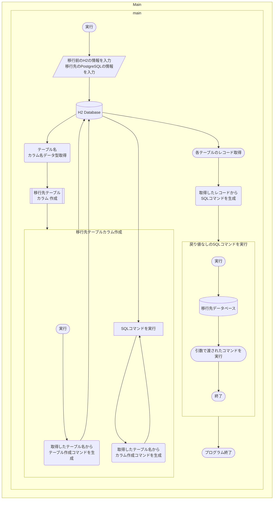

# ◇H2DB-to-SQL
  
H2 DatabaseからPostgreSQLにデータを移行するプログラムです。  
自分で利用するために急ぎ制作しました。今後の更新、他のデータベースへの対応、例外処理等を行うかは 未定です。  
  
利用する場合は以下のドライバをライブラリに追加する必要があります。  
[H2 JDBC Driver (https://www.h2database.com/html/download.html)](https://www.h2database.com/html/download.html)  
[PostgreSQL JDBC Driver (https://jdbc.postgresql.org/download.html)](https://jdbc.postgresql.org/download.html)  
  
  
  
## ◇フローチャート  
  


## ◇更新履歴  

```changelog
============================================
v1.0
・ソース公開

============================================
```
