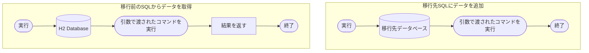

# ◇H2DB-to-SQL
  
H2 DatabaseからPostgreSQLにデータを移行するプログラムです。  
自分で利用するために急ぎ制作しました。今後の更新、他のデータベースへの対応、例外処理等を行うかは 未定です。  
  
利用する場合は以下のドライバをライブラリに追加する必要があります。  
[H2 JDBC Driver (https://www.h2database.com/html/download.html)](https://www.h2database.com/html/download.html)  
[PostgreSQL JDBC Driver (https://jdbc.postgresql.org/download.html)](https://jdbc.postgresql.org/download.html)  
  
  
  
## ◇フローチャート  


```mermaid
flowchart TD
subgraph テーブル名<br>カラム名データ型取得
    gtcrun([実行]) --> gtc1[[移行前のSQLからデータを取得]] -->  gtc2(フィールドに<br>テーブル名カラム名を代入) --> gtcfin([終了])
end
subgraph レコード取得,移行
    agrrun([実行]) --> agr1[[移行前のSQLからデータを取得]] --> agr2(レコードを代入) --> agr3[[移行先SQLにデータを追加]] --> agrfin([終了])
    end
subgraph 移行先テーブルカラム作成
    tccrun([実行]) --> tcc1(取得したテーブル名から<br>テーブル作成コマンドを生成) --> tcc2[[移行先SQLにデータを追加]] --> tcc3(取得したテーブル名から<br>カラム作成コマンドを生成) --> tccfin[[移行先SQLにデータを追加]]
end
```



## ◇更新履歴  

```changelog
============================================
v1.0
・ソース公開

============================================
```
